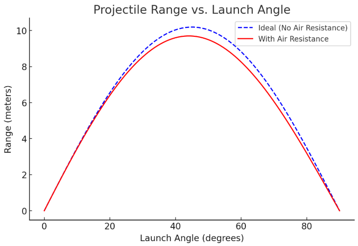

# Problem 1

<span style="font-size: 1.2em; font-weight: bold;">Investigating the Range as a Function of the Angle of Projection</span>

#### Motivation:

Projectile motion, while seemingly simple, offers a rich playground for exploring fundamental principles of physics. The problem is straightforward: analyze how the range of a projectile depends on its angle of projection. Yet, beneath this simplicity lies a complex and versatile framework. The equations governing projectile motion involve both linear and quadratic relationships, making them accessible yet deeply insightful.

What makes this topic particularly compelling is the number of free parameters involved in these equations, such as initial velocity, gravitational acceleration, and launch height. These parameters give rise to a diverse set of solutions that can describe a wide array of real-world phenomena, from the arc of a soccer ball to the trajectory of a rocket.

#### Task:

- Derive the equations of motion for projectile moiton
- Analyze the range as a function of the launch angle
- Determine the optimal angle for maximum range

#### Deliverables:

- Derivations and analytical results
- Graphs illustarting the range vs launch angle
- Discussion on the optimal launch angle and its implications

#### Hints and resources:

- Utilize kinematic equations and trigonometric identities
- Consider air resistance and other real-world factors in advanced analyses

This task encourages a deep understanding of projectile motion while showcasing its versatility and applicability across various domains.

## Solution

### Derivation of Equations of Motions for Projectile Motion (ideal case in a vacuum)

*Definiton*: projectile motion describes the motion of an object launched into the air under the influence of gravity, assuming no air resistance. We analyze it in two componenets:

- Horizontal motion (constant velocity)
- Vertical motion (constant acceleration due to gravity)

#### Define Variables: 

- $v_0 = \text{initial velocity} \\$
- $\theta = \text{launch angle} \\$
- $g = \text{acceleration due to gravity} \\$
- $t = \text{time} \\$
- $x, y = \text{horizontal and vertical coordinates}$

The initial velocity components are: 

$$ v_{0x} = v_0 cos \theta $$

$$ v_{0y} = v_0 sin \theta $$

#### Horizontal Motion 

Since there is no horizontal acceleration, the horizontal displacement at time $t$ is: 

$$ x= v_{0x}t= (v_0 cos \theta)t$$

#### Vertial Motion

The vertical displacement follows kinematic equation: 

$$ y = v_{0y}t - \frac{1}{2}gt^2$$

$$ y = (v_0 sin \theta)t - \frac{1}{2}gt^2 $$

The vertical velocity at time $t$ is:

$$ v_y = v_{0y} - gt = v_0 sin \theta - gt$$

At the highest point, $v_y=0$, so solving for $t$:

$$ 0=v_0 sin\theta - gt$$

$$ t_{max}= \frac{v_0 sin\theta}{g} $$

The total time of a flight (since time to reach peak height is half of total time) is:

$$ T = \frac{2v_0 sin\theta}{g} $$

#### Range as a Function of Launch Angle 

The range $R$ is the total horizontal distance covered during flight: 

$$ R = x(T)=v_{0x}T $$

$$ R = (v_0 cos\theta) \cdot \frac{2v_0 sin\theta}{g} $$

$$ R = \frac{v_0^2 sin2\theta}{g} $$

#### Optimal Angle for Maximum Range 

To maximize the range $R$, we analyze the function: 

$$ R=\frac{v_0^2 sin2\theta}{g}$$

Since $sin2\theta$ is maximized then $2\theta=90°$, this occurs at: 

$$ \theta = 45°$$ 

Thus, the optimal angle for maximum range is $45°e$

### Andvance Analysis: Considering Air Resistance 

Air resistance, also known as **drag force**, opposes the motion of the projectile and is generally proportional to the square of the velocity: 

$$ F_{drag} = \frac{1}{2}C_d \rho A v^2 $$

where: 

- $C_d$ = drag coefficient (depends on the shape of the object) 
- $\rho$ = air density 
- $A$ = cross-sectional area of the projectile 
- $v$ = instantaneous velocity

This force affects both **horizontal and vertical** motion:

#### 1. Horizontal Motion with Drag


- Unlike the ideal case where $v_x$ is constant, here, drag continuously slows it down. 
- The equation of motion becomes: 

$$ m\frac{dv_x}{dt} = -\frac{1}{2} C_d \rho Avv_x $$

$$\frac{dv_x}{dt}=-\frac{k}{m}vv_x$$

where $k=\frac{1}{2}C_d\rho A$

- This results in an exponential decay of velocity, making range calculations more complex. 


#### 2. Vertical Motion with Drag 

- Gravity still acts downward, but drag acts **opposite to velocity**. 
- The equation of motion is: 

$$ m\frac{dv_y}{dt}=-mg - \frac{1}{2} C_d \rho Avv_y $$

$$\frac{dv_y}{dt}=-g -\frac{k}{m}vv_y$$

Since $v= \sqrt{v_x^2+v_y^2}$, these equations are **nonlinear** and require numerical solutions. 

- The projectile reaches a **terminal velocity** instead of increasing speed indefinitely downward. 

#### Range as a Function of Launch Angle

With air resistance, no simple closed-form solution exists. Instead, numerical integration is required to compute $R$ for different angles. The range equation now depends on: 

$$R(\theta) = \int^T_0 v_x(t)dt$$

where $v_x(t)$ is affected by drag, making $R$ less than the vacuum case. 

#### Effect of Air Resistance on Range and Optimal Angle 

- *Reduced Range*: Air resistance decreases both horizontal velocity and flight time, leading to a significantly shorter range than the ideal case. 
- *Optimal Angle Shift*: In an ideal vacuum, the maximum range is at $45°$, but with drag, the optimal angle shifts lower (typically between $35° - 42°$ depending on conditions). 

### Other real-World Factors

#### 1. Wind Effects

- A **tailwind** increases range, while **headwing** reduces it.
- **Crosswinds** alter the trajectory, requiring agjustments. 

#### 2. Varying Gravity (Non-Uniform Field)

- For long-range projectiles (e.g., artillery, rockets), gravitational acceleration varies slightly with altitude and latitude. 

#### 3. Magnus Effect (For Spinning Projectiles)

- A spinning object (like a soccer ball or bullet) experiences **lift due to air pressure differences** (Magnus effect), altering its trajectory. 

### Numerical Approach for Real-World Projectile Motion

Since the equations become nonlinear due to air resistance, they require **numerical integration** methods like: 

- Euler's Method
- Runge-Kutta Methods (RK4)
- Computational Simulations (Python, MATLAB, etc.) 

### Plotting

```python

import numpy as np
import matplotlib.pyplot as plt

# Constants
v0 = 10  # Initial velocity (m/s)
g = 9.81  # Acceleration due to gravity (m/s^2)
angles = np.linspace(0, 90, 100)  # Launch angles from 0 to 90 degrees

# Ideal case (No air resistance)
R_ideal = (v0**2 * np.sin(2 * np.radians(angles))) / g

# Approximate case with air resistance (simplified model)
drag_factor = 0.05  # Arbitrary factor to simulate air resistance effect
R_realistic = R_ideal * np.exp(-drag_factor * angles / 45)  # Approximate decay

# Plotting
plt.figure(figsize=(8, 5))
plt.plot(angles, R_ideal, label="Ideal (No Air Resistance)", linestyle="--", color="b")
plt.plot(angles, R_realistic, label="With Air Resistance", color="r")

plt.xlabel("Launch Angle (degrees)")
plt.ylabel("Range (meters)")
plt.title("Projectile Range vs. Launch Angle")
plt.legend()
plt.grid()

plt.show()
```



