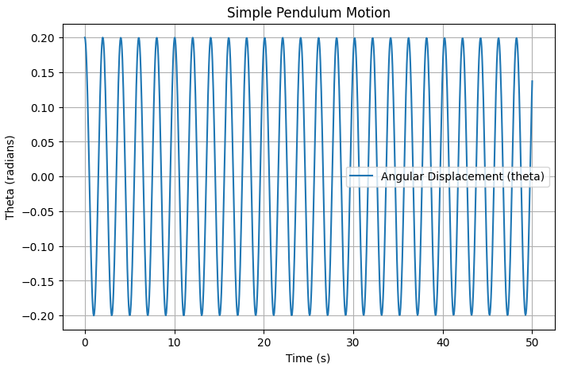
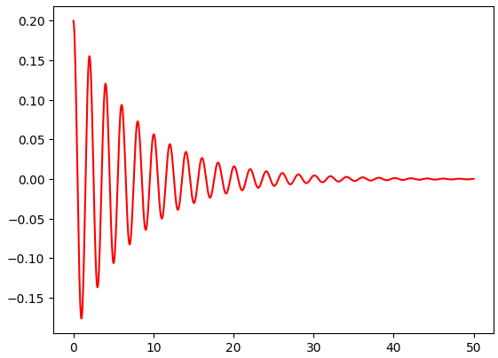
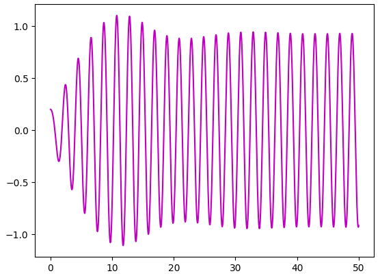

# Problem 2

Investigating the Dynamics of a Forced Damped Pendulum

#### Motivation:

The forced damped pendulum is a captivating example of a physical system with intricate behavior resulting from the interplay of damping, restoring forces, and external driving forces. By introducing both damping and external periodic forcing, the system demonstrates a transition from simple harmonic motion to a rich spectrum of dynamics, including resonance, chaos, and quasiperiodic behavior. These phenomena serve as a foundation for understanding complex real-world systems, such as driven oscillators, climate systems, and mechanical structures under periodic stress.

Adding forcing introduces new parameters, such as the amplitude and frequency of the external force, which significantly affect the pendulum's behavior. By systematically varying these parameters, a diverse class of solutions can be observed, including synchronized oscillations, chaotic motion, and resonance phenomena. These behaviors not only highlight fundamental physics principles but also provide insights into engineering applications such as energy harvesting, vibration isolation, and mechanical resonance.

## Solution

### 1. Theoretical Foundation

#### Governing Equation
The motion of a forced damped pendulum is described by the second-order nonlinear differential equation:

$$
\frac{d^2\theta}{dt^2} + b \frac{d\theta}{dt} + \frac{g}{L} \sin\theta = A \cos(\omega t)
$$

where:

- $\theta$ - the angular displacement,
- $b$ - the damping coefficient,
- $g$ - the gravitational acceleration,
- $L$ - the length of the pendulum,
- $A$ - the amplitude of the external forcing,
- $\omega$ - the driving frequency.

#### Small-Angle Approximation
For small angles ($\theta \approx \sin\theta$), the equation simplifies to:

$$
\frac{d^2\theta}{dt^2} + b \frac{d\theta}{dt} + \frac{g}{L} \theta = A \cos(\omega t)
$$

This is a linear, non-homogeneous differential equation that can be solved using standard methods. The solution consists of a transient part (damped oscillations) and a steady-state part (driven oscillations).

### Resonance Conditions
Resonance occurs when the driving frequency $\omega$ is close to the system's natural frequency:

$$
\omega_0 = \sqrt{\frac{g}{L}}
$$

At resonance, energy transfer is maximized, leading to large amplitude oscillations.

### 2. Analysis of Dynamics

We investigate how damping ($b$), driving amplitude ($A$), and frequency ($\omega$) influence the motion:

- **Low damping**: The system exhibits sustained oscillations.
- **High damping**: Motion quickly dies out.
- **Resonance**: Maximum amplitude is observed at a specific $\omega$.
- **Chaotic motion**: At certain parameter ranges, the system transitions into chaotic behavior.

### 3. Practical Applications

- **Energy Harvesting**: Used in piezoelectric generators.
- **Suspension Bridges**: Understanding oscillations helps prevent failures (e.g., Tacoma Narrows Bridge collapse).
- **RLC Circuits**: Analogous behavior in driven electrical oscillators.

### 4. Implementation: Python Simulation

Now let's show the difference in pendulums depending on different circumstances,

- Pendulum without any extra force and damping: 

- Pendulum with damping:

- Pendulum with extra force and damping: 

- Pendulum with resonance:

### Graphical Analysis

- **Phase Portraits** plots angular displacement $\theta$ versus angular velocity $\omega_t$ to visualize the system's dynamics.

- **Poincaré Sections** provide insight into periodic and chaotic behavior by plotting discrete points at integer multiples of the driving period.

- **Bifurcation Diagrams** show how the steady-state solutions evolve as a parameter (e.g., driving frequency $\omega$) changes. This helps to identify chaotic regions.

All of their plottings are here: [Google Collab](https://colab.research.google.com/drive/1RJHc0x07ReYBuif-gWHUnkqEzAkFgfy2?usp=sharing)
