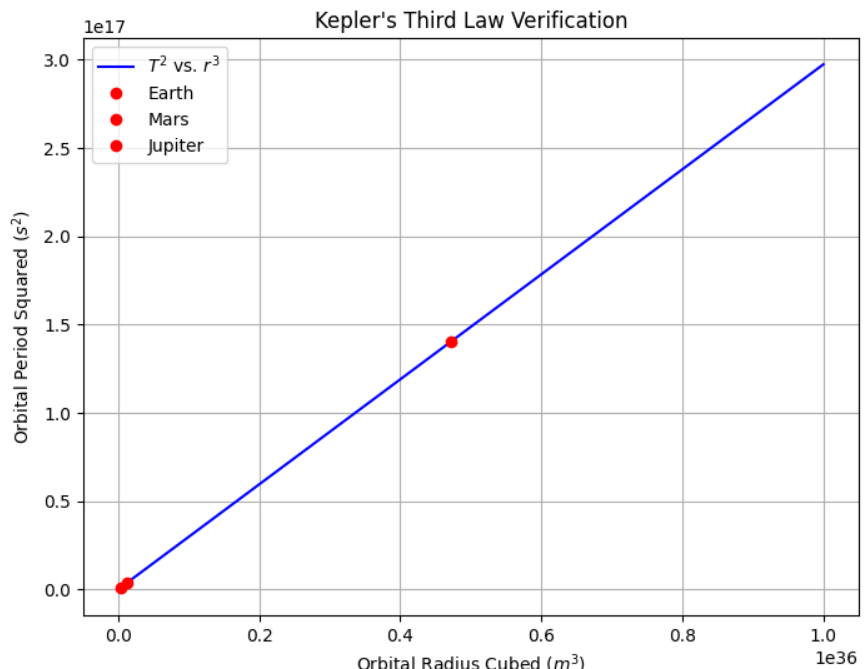
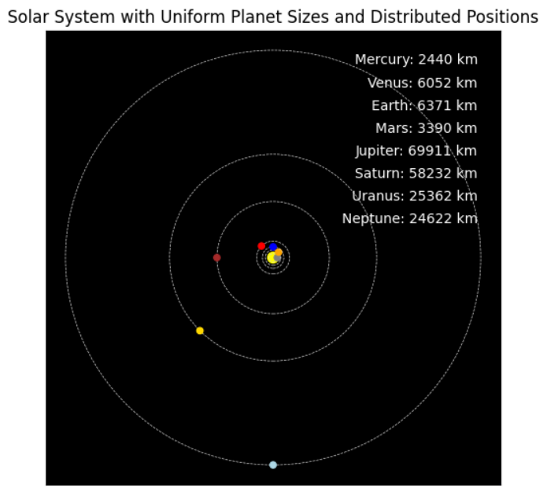

# Problem 1
# Orbital Period and Orbital Radius

## Motivation
The relationship between the square of the orbital period and the cube of the orbital radius, known as **Kepler's Third Law**, is a fundamental principle in celestial mechanics. This law provides insights into planetary motions and gravitational interactions at various scales, from satellites orbiting Earth to exoplanetary systems in distant galaxies. Understanding this relationship allows us to determine planetary masses, distances, and orbital characteristics with high accuracy.

---

## Theoretical Derivation
Kepler's Third Law states that the square of the orbital period $T$ is proportional to the cube of the semi-major axis (or radius $r$ for circular orbits):

$$T^2 \propto r^3.$$

To derive this relationship from Newton's Laws and gravitational principles:

1. The gravitational force provides the necessary centripetal force for a body in circular orbit:

   $F_g = \frac{G M m}{r^2}, \quad F_c = m \frac{v^2}{r}$

   Setting these equal to each other:

   $\frac{G M m}{r^2} = m \frac{v^2}{r}$

2. The orbital velocity $v$ is given by:

   $v = \frac{2\pi r}{T}$

   Substituting into the force equation:

   $\frac{G M}{r^2} = \frac{(2\pi r)^2}{T^2 r}$

3. Simplifying:

   $T^2 = \frac{4\pi^2}{G M} r^3$

This confirms Kepler's Third Law, with the proportionality constant $\frac{4\pi^2}{G M}$

### Key Variables for Orbital Motion

**Orbital Parameters**

- $M$ → Mass of the central body (e.g., the Sun, Earth) (kg)

- $m$ → Mass of the orbiting object (e.g., a planet, satellite) (kg)

- $r$ → Orbital radius (distance from the center of mass) (m)

- $T$ → Orbital period (time to complete one orbit) (s)

- $v$ → Orbital velocity (m/s)

**Gravitational Constants**

- $G = 6.674 x 10^{-11} m^3/kg \cdot s^2$ → Universal gravitational constant

 **1. Orbital Velocity**

The velocity of an object in a stable circular orbit is given by:

$v = \sqrt{\frac{G M}{r}}$

 **2. Orbital Period (Kepler's Third Law)**

The time required to complete one full orbit:

$T = 2\pi \sqrt{\frac{r^3}{G M}}$

## Astronomical Implications
This relationship is crucial in determining:

- The masses of celestial bodies by observing the orbital periods and radii of their satellites.

- The distances of exoplanets from their host stars.

- The orbital mechanics of artificial satellites.

**Examples:**

- The Moon’s orbit around Earth follows this law, allowing astronomers to estimate Earth’s mass.

- The planets in the Solar System follow this relationship, confirming Newtonian gravity.

## Computational Model

We implement a Python simulation to verify this relationship numerically.

### **Python Implementation: Kepler's Third Law Verification**

### **Conclusion**
Kepler’s Third Law provides a fundamental link between gravity and planetary motion, offering critical insights into astrophysics and space exploration. Its computational verification further strengthens its role as a cornerstone of celestial mechanics.

A GIF of orbital motion and all plot codes in: [Google Collab](https://colab.research.google.com/drive/1qLvtIVOvNFZVebJs_L2Bp4DgAH0eoSg_?usp=sharing)
