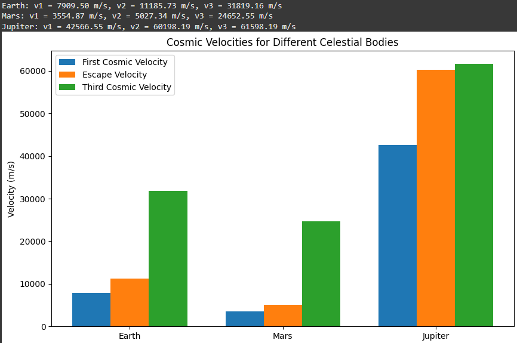

# Problem 2
# Escape Velocities and Cosmic Velocities

## Motivation
The concept of escape velocity is crucial for understanding the conditions required to leave a celestial body's gravitational influence. Extending this concept, the first, second, and third cosmic velocities define the thresholds for orbiting, escaping, and leaving a star system. These principles underpin modern space exploration, from launching satellites to interplanetary missions.

## Definitions

### First Cosmic Velocity (Orbital Velocity)
The first cosmic velocity is the minimum speed an object must have to maintain a stable circular orbit around a celestial body. It is given by:

$$
v_1 = \sqrt{\frac{GM}{R}}
$$

where:
- $ G $ - is the gravitational constant $6.674 \times 10^{-11} \text{m}^3\text{kg}^{-1}\text{s}^{-2}$,
- $ M $ - is the mass of the celestial body,
- $ R $ - is the radius of the orbit (usually taken as the radius of the celestial body for low orbits).

### Second Cosmic Velocity (Escape Velocity)
The second cosmic velocity is the minimum speed an object must attain to escape the gravitational field of a celestial body without further propulsion. It is given by:

$$
v_2 = \sqrt{\frac{2GM}{R}}
$$

This velocity is derived from energy conservation principles where the total energy (kinetic + potential) becomes zero at infinity.

### Third Cosmic Velocity (Interstellar Escape Velocity)
The third cosmic velocity is the velocity required to escape not just a planet but also the gravitational influence of the Sun or another central celestial body. It depends on both the escape velocity from the planet and the velocity relative to the Sun.

A simplified approximation is:

$$
v_3 = \sqrt{v_2^2 + v_s^2}
$$

where $ v_s $ is the orbital velocity of the planet around the Sun.

## Mathematical Analysis

1. **Dependence on Mass and Radius**: Higher mass increases gravitational pull, requiring higher velocities. Larger radius reduce the required velocity due to weaker surface gravity.
2. **Energy Considerations**: Escape velocity is derived by equating kinetic and gravitational potential energy.
3. **Planetary Comparisons**: Different planets have different escape velocities depending on their mass and radius.

## Calculation and Visualization
A Python script to calculate and plot the first, second, and third cosmic velocities for Earth, Mars, and Jupiter:

```python
import numpy as np
import matplotlib.pyplot as plt

# Constants
G = 6.674e-11  # Gravitational constant (m^3/kg/s^2)
planetary_data = {
    "Earth": {"M": 5.972e24, "R": 6.371e6, "V_s": 29780},
    "Mars": {"M": 6.417e23, "R": 3.389e6, "V_s": 24130},
    "Jupiter": {"M": 1.898e27, "R": 6.9911e7, "V_s": 13070},
}

# Compute velocities
results = {}
for planet, data in planetary_data.items():
    M, R, V_s = data["M"], data["R"], data["V_s"]
    v1 = np.sqrt(G * M / R)
    v2 = np.sqrt(2 * G * M / R)
    v3 = np.sqrt(v2**2 + V_s**2)
    results[planet] = (v1, v2, v3)

# Plot results
labels = list(planetary_data.keys())
v1_values = [results[planet][0] for planet in labels]
v2_values = [results[planet][1] for planet in labels]
v3_values = [results[planet][2] for planet in labels]

x = np.arange(len(labels))
width = 0.3

fig, ax = plt.subplots()
ax.bar(x - width, v1_values, width, label='First Cosmic Velocity')
ax.bar(x, v2_values, width, label='Second Cosmic Velocity')
ax.bar(x + width, v3_values, width, label='Third Cosmic Velocity')

ax.set_xlabel('Planet')
ax.set_ylabel('Velocity (m/s)')
ax.set_title('Cosmic Velocities of Celestial Bodies')
ax.set_xticks(x)
ax.set_xticklabels(labels)
ax.legend()
plt.show()
```

## Importance in Space Exploration

1. **Launching Satellites**: The first cosmic velocity determines the speed needed to place satellites in orbit.
2. **Interplanetary Travel**: The second cosmic velocity is crucial for escaping planetary gravity wells and reaching other planets.
3. **Interstellar Missions**: The third cosmic velocity is necessary for leaving the Solar System, relevant to missions like Voyager and future interstellar exploration.

Understanding these velocities allows for precise mission planning, fuel efficiency optimization, and advancements in space travel.


Here's a structured Markdown document covering the concepts of escape and cosmic velocities, including derivations and calculations for Earth, Mars, and Jupiter.  

---

# Escape Velocities and Cosmic Velocities  

## **1. Introduction**  

The ability to overcome a celestial body's gravitational influence is crucial for space exploration. Three significant velocity thresholds are:  

- **First Cosmic Velocity** ($v_1$): The velocity required to maintain a stable circular orbit around a celestial body.
- **Second Cosmic Velocity (Escape Velocity)** ($v_2$): The velocity required to completely escape the celestial body's gravitational field.
- **Third Cosmic Velocity** ($v_3$): The velocity required to escape the gravitational influence of the central star (e.g., the Sun).  

These velocities are fundamental in space mission planning, from launching satellites to interstellar travel.

---

## **2. Mathematical Derivation**  

### **First Cosmic Velocity ($v_1$) - Orbital Velocity**  

For a satellite in a circular orbit at radius $r$ from the center of a celestial body of mass $M$, the gravitational force provides the required centripetal force:  

$$ \frac{G M m}{r^2} = \frac{m v_1^2}{r} $$

Solving for $v_1$:  

$$ v_1 = \sqrt{\frac{G M}{r}} $$

### **Second Cosmic Velocity ($v_2$) - Escape Velocity**  

Escape velocity is derived from energy conservation. A body starting at $r$ with velocity $v_2$ should reach infinity with zero kinetic energy:  

$$ \frac{1}{2} m v_2^2 - \frac{G M m}{r} = 0 $$

Solving for $v_2$:  

$$ v_2 = \sqrt{\frac{2 G M}{r}} $$

### **Third Cosmic Velocity ($v_3$) - Solar System Escape Velocity**  

To escape the Sun’s gravitational pull from a planet, we use:  

$$ v_3 = \sqrt{v_2^2 + v_{\text{orb}}^2} $$

where $v_{\text{orb}}$ is the planet’s orbital velocity around the Sun:  

$$ v_{\text{orb}} = \sqrt{\frac{G M_{s}}{R}} $$

where $M_{s}$ is the Sun’s mass and $R$ is the planet’s distance from the Sun.

---

## **3. Calculations for Earth, Mars, and Jupiter**  

Using standard values:  
- Gravitational constant: $G = 6.674 \times 10^{-11} \, \text{m}^3 \text{kg}^{-1} \text{s}^{-2}$  
- Earth: $M_E = 5.972 \times 10^{24}$ kg, $R_E = 6371 \times 10^3$ m  
- Mars: $M_M = 6.417 \times 10^{23}$ kg, $R_M = 3389 \times 10^3$ m  
- Jupiter: $M_J = 1.898 \times 10^{27}$ kg, $R_J = 69911 \times 10^3$ m  

We compute:

$$ v_{1E} = \sqrt{\frac{G M_E}{R_E}} $$

$$ v_{2E} = \sqrt{2} v_{1E} $$

$$ v_{3E} = \sqrt{v_{2E}^2 + v_{\text{orbE}}^2} $$

Similar calculations follow for Mars and Jupiter.

### **Conditions Analysis**

1. **Dependence on Mass and Radius**: Higher mass increases gravitational pull, requiring higher velocities. Larger radius reduce the required velocity due to weaker surface gravity.
2. **Energy Considerations**: Escape velocity is derived by equating kinetic and gravitational potential energy.
3. **Planetary Comparisons**: Different planets have different escape velocities depending on their mass and radius.

---

## **4. Python Calculation & Visualization**  



---

## **5. Importance in Space Exploration**  

1. **Satellite Deployment:**  

   - First cosmic velocity determines stable orbits.  
   - Used for communications, weather, and research satellites.  

2. **Interplanetary Missions:**  

   - Second cosmic velocity allows escape to other planets.  
   - Used for Mars rovers and deep-space probes.  

3. **Interstellar Travel:**  

   - Third cosmic velocity enables missions beyond the solar system.  
   - Future missions (e.g., Breakthrough Starshot) aim to reach this velocity.  

---

## **6. Conclusion**  

The concept of cosmic velocities is fundamental to space travel, defining the energy requirements for various missions. Understanding these velocities helps optimize spacecraft design and mission planning, leading to efficient exploration of the cosmos.

All plot codes in: [Google Collab](https://colab.research.google.com/drive/1qLvtIVOvNFZVebJs_L2Bp4DgAH0eoSg_?usp=sharing)
