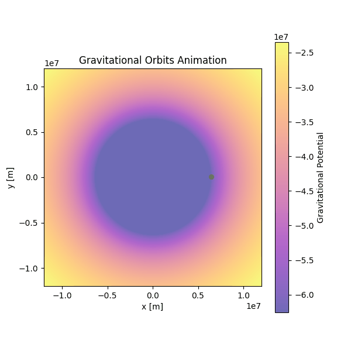
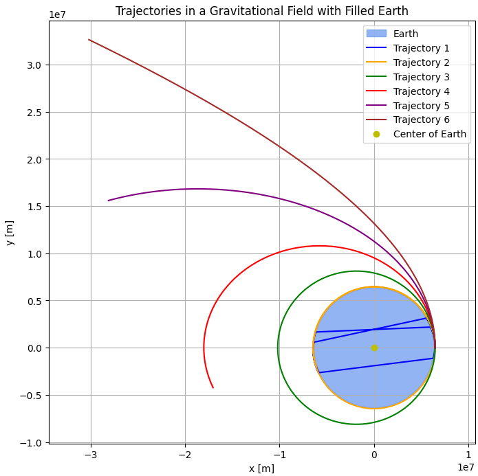

# Problem 3

# Trajectories of a Freely Released Payload Near Earth

## Introduction

When an object is released from a moving rocket near Earth, its trajectory depends on initial conditions and gravitational forces. This scenario presents a rich problem, blending principles of orbital mechanics and numerical methods. Understanding the potential trajectories is vital for space missions, such as deploying payloads or returning objects to Earth.

## Theoretical Background

The motion of an object near Earth is governed by **Newton's Law of Gravitation**, which states that the gravitational force between two masses $m_1$ and $m_2$ is given by:

$$ F = \frac{G m_1 m_2}{r^2} $$

Where:

- $G$ - is the gravitational constant $6.674 \times 10^{-11} \, \text{m}^3 \, \text{kg}^{-1} \, \text{s}^{-2}$,
- $m_1$ and $m_2$ - are the masses of the two objects (in this case, the Earth and the payload),
- $r$ - is the distance between the center of Earth and the object.

For a freely released payload, the net force on it is the gravitational force exerted by the Earth. This force causes the object to accelerate toward Earth, and its trajectory is influenced by the initial velocity and position at the time of release.

The equations of motion are derived from **Newton's second law**:

$$ \vec{F} = m \vec{a} $$

Substituting the gravitational force into this equation:

$$ m \vec{a} = -\frac{G M m}{r^2} \hat{r} $$

Where:
- $M$ - is the mass of Earth,
- $\hat{r}$ - is the unit vector in the direction of the position vector $\vec{r}$ of the object relative to Earth's center.

This gives the acceleration:

$$ \vec{a} = -\frac{GM}{r^2} \hat{r} $$

This equation governs the trajectory of the object. Depending on the initial velocity and position, the trajectory can be **parabolic**, **elliptical**, or **hyperbolic**.

### Parabolic Trajectory

For a parabolic trajectory, the total mechanical energy of the system is zero, meaning the object has just enough velocity to escape from Earth's gravitational pull without actually escaping. The equation governing the trajectory for a parabolic escape is derived from conservation of energy:

$$ E = \frac{1}{2} m v^2 - \frac{G M m}{r} = 0 $$

Where:

- $E$ - is the total mechanical energy,
- $m$ - is the mass of the object (payload),
- $v$ - is the velocity of the object,
- $r$ - is the distance from the center of Earth,
- $G$ - is the gravitational constant,
- $M$ - is the mass of Earth.

Rearranging this equation:

$$ \frac{1}{2} m v^2 = \frac{G M m}{r} $$

This shows that the object’s kinetic energy at release is equal to the gravitational potential energy. For a parabolic trajectory, the velocity at the point of release (escape velocity) is given by:

$$ v_{\text{escape}} = \sqrt{\frac{2 G M}{r}} $$

Where $r$ is the distance from Earth's center to the object.

### Elliptical Trajectory

For an elliptical trajectory, the total mechanical energy of the system is negative, meaning the object is bound to Earth's gravity but will orbit in an elliptical path. The total energy for an elliptical orbit is given by:

$$ E = -\frac{G M m}{2a} $$

Where $a$ is the semi-major axis of the ellipse.

The velocity of the object at any point in its orbit can be derived using the vis-viva equation:

$$ v = \sqrt{ G M \left( \frac{2}{r} - \frac{1}{a} \right) } $$

Where:

- $r$ is the current distance of the object from Earth,
- $a$ is the semi-major axis.

This equation governs the speed of the object at any point in the elliptical orbit. If the velocity is not sufficient to escape Earth's gravity but still greater than the circular orbital velocity, the object follows an elliptical trajectory.

### Hyperbolic Trajectory

For a hyperbolic trajectory, the total mechanical energy is positive, meaning the object has enough energy to escape Earth's gravitational field. The total energy for a hyperbolic orbit is:

$$ E = \frac{1}{2} m v^2 - \frac{G M m}{r} > 0 $$

The velocity at any point on a hyperbolic trajectory can be expressed by the vis-viva equation, which simplifies for a hyperbolic trajectory as:

$$ v = \sqrt{ G M \left( \frac{2}{r} + \frac{1}{a} \right) } $$

Where:

- $a$ is the semi-major axis of the hyperbolic trajectory (note that $a$ is negative for hyperbolic orbits),
- $r$ is the current distance of the object from Earth.

The escape velocity for a hyperbolic trajectory, where the object has just enough energy to escape Earth's gravity, is given by:

$$ v_{\text{escape}} = \sqrt{\frac{2 G M}{r}} $$

This is the same as the escape velocity for a parabolic trajectory, but for a hyperbolic trajectory, the object will continue moving away from Earth indefinitely once it reaches escape velocity.

These equations describe the key differences between the three types of trajectories:
- **Parabolic** trajectories occur when the object has just enough velocity to escape Earth's gravity, resulting in a return to Earth or continuing to infinity.
- **Elliptical** trajectories describe objects in orbit, where they will eventually return to Earth.
- **Hyperbolic** trajectories describe objects that have enough energy to escape Earth's gravitational pull and continue moving away indefinitely.

## Numerical Method

We will use the **Runge-Kutta method** to numerically integrate the equations of motion. This method provides a more accurate solution than the Euler method.

The Runge-Kutta method involves computing the following intermediate steps:

1. $k_1$ values at the current position and velocity,
2. $k_2$ values at an intermediate position and velocity using the $k_1$ values,
3. $k_3$ values at another intermediate step using the $k_2$ values,
4. $k_4$ values at the new position and velocity, and then,
5. The new position and velocity are computed as a weighted sum of the $k_1$, $k_2$, $k_3$, and $k_4$ values.

## Real-World Applications

- Orbital Insertion: This is crucial when launching satellites or spacecraft. If the initial velocity is adjusted correctly, the payload can enter a stable orbit around Earth.

- Reentry: If a payload is released with a velocity that brings it back toward Earth, it may reenter the atmosphere. This is a key consideration for spacecraft returning to Earth.

- Escape Velocity: If the payload is released with sufficient velocity (about 11.2 km/s from Earth's surface), it will escape Earth's gravitational influence, which is important for missions to other planets or deep space.

## Conclusion

This problem explores the principles of gravitational dynamics and numerical methods to simulate the motion of a payload released near Earth. The trajectory depends on the initial conditions, and understanding these trajectories is essential for space missions, including satellite deployment, reentry, and escape scenarios.

All plot codes in: [Google Collab](https://colab.research.google.com/drive/1qLvtIVOvNFZVebJs_L2Bp4DgAH0eoSg_?usp=sharing)
