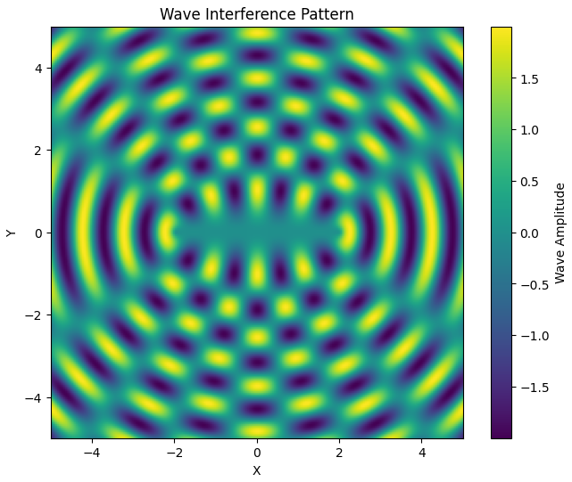
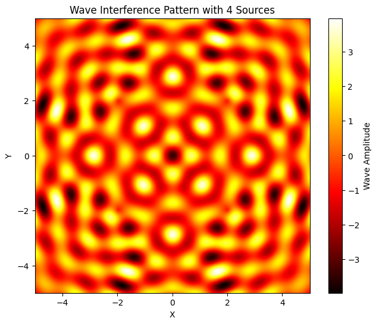
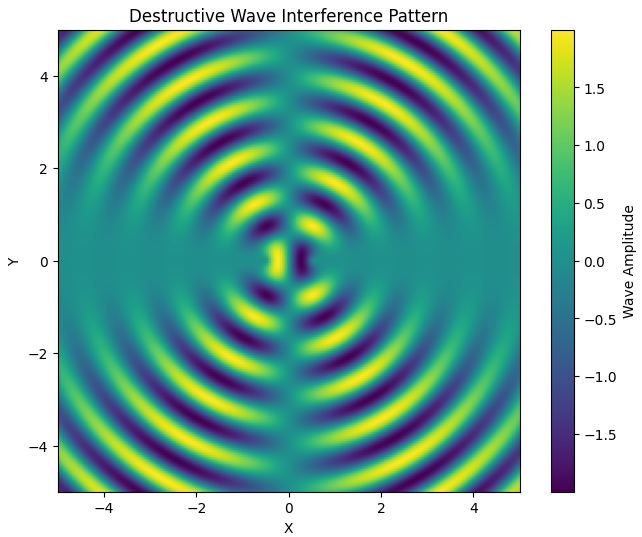

# Problem 1: Interference Patterns on a Water Surface

## Motivation

Interference occurs when waves from different sources overlap, creating new patterns. On a water surface, this can be easily observed when ripples from different points meet, forming distinctive interference patterns. These patterns show how waves can reinforce each other (constructive interference) or cancel out (destructive interference).

Studying these patterns helps us understand fundamental wave behavior. This task is both visual and hands-on, making it an effective way to explore important physical concepts such as wave phase, coherence, and superposition.

---

## Theoretical Background

### Wave Equation for a Single Source

The disturbance $\eta(x, y, t)$ at a point $(x, y)$ on the surface caused by a single point source located at $(x_0, y_0)$ is given by the equation:

$$
\eta(x, y, t) = \frac{A}{ \sqrt{r}} \cos(kr - \omega t + \phi)
$$

Where:

* $\eta(x, y, t)$ is the displacement of the water surface at point $(x,y)$ and time $t$ 
* $A$ is the wave amplitude.
* $r = \sqrt{(x - x_0)^2 + (y - y_0)^2}$ is the distance from the source to the point $(x, y)$.
* $k = \frac{2\pi}{\lambda}$ is the wave number, with $\lambda$ being the wavelength.
* $\omega = 2\pi f$ is the angular frequency, with $f$ being the frequency.
* $\phi$ is the initial phase of the wave.

This function models circular ripples decreasing in amplitude with distance, a typical behavior on a water surface.

### Superposition of Multiple Waves

When there are multiple sources, the disturbances at each point due to each source are summed together:

$$
\eta_{\text{sum}}(x, y, t) = \sum_{i=1}^{N} \eta_i(x, y, t)
$$

This is based on the principle of linear superposition, valid for small amplitude waves.

---

## Step-by-Step Solution

### Step 1: Choose a Regular Polygon

For this experiment, we choose a **square** — a regular polygon with 4 equal-length sides and 4 vertices. This shape offers symmetric arrangement and provides insight into multi-source interference effects.

### Step 2: Position the Sources

The point sources will be positioned at the four vertices of the square, centered at the origin (0, 0). The radius of the circumscribed circle is taken as 1.5 units. The coordinates of the vertices are computed as:

$$
(x_i, y_i) = (R \cos \theta_i, R \sin \theta_i),\quad \theta_i = \frac{2\pi i}{N},\ i = 0,1,...,N-1
$$

For $N = 4$, this gives us the vertices at 90° intervals.

### Step 3: Compute Wave Displacement on Grid

We simulate a water surface by defining a 2D grid over a domain from $-3$ to $3$ units in both $x$ and $y$. For each source, we calculate the wave contribution at every point on the grid using the wave equation, and sum them to get the total displacement.

All python codes for plots are in [Collab](https://colab.research.google.com/drive/1Hq642bjnQNbDaTqGoPiwqAwoFRSZfQ7B?usp=sharing)

### Step 4: Interpretation and Analysis

* **Constructive Interference**: Occurs where the wave crests from multiple sources align. These are represented by the most intense red or blue regions in the plot, showing amplification.

* **Destructive Interference**: Occurs where crests from some sources meet troughs from others. These regions appear as pale or near-zero areas in the plot, indicating cancellation.

* **Symmetry**: Because the sources are placed in a square arrangement, the resulting interference pattern also exhibits square symmetry — both reflectional and rotational. You can notice repeating wavefront motifs radiating outward and symmetric interference bands.

* **Wave Nodes and Antinodes**: Nodes (points of no displacement) and antinodes (points of maximum displacement) form as a result of fixed phase relationships between sources. The locations of these are determined by the distances between the sources and the grid points.

---

## Conclusion

This simulation illustrates the rich structure of wave interference patterns produced by multiple point sources arranged in a regular polygon. By analyzing a square configuration, we observe both constructive and destructive interference, symmetrical patterns, and the physical significance of wave superposition.

This model can be extended to other polygons (e.g., triangle, hexagon) or animated over time to visualize dynamic behavior. Such models are not only useful for visual learning but also applicable in acoustics, optics, and engineering domains involving wave interactions.

