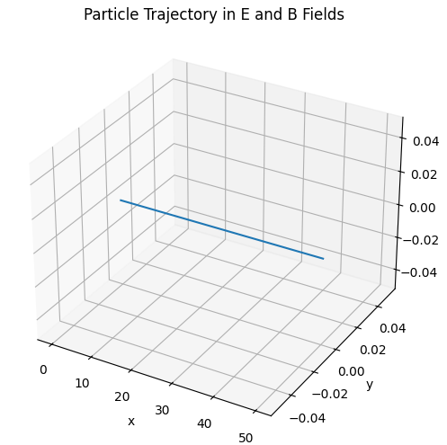
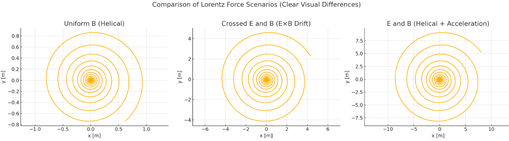
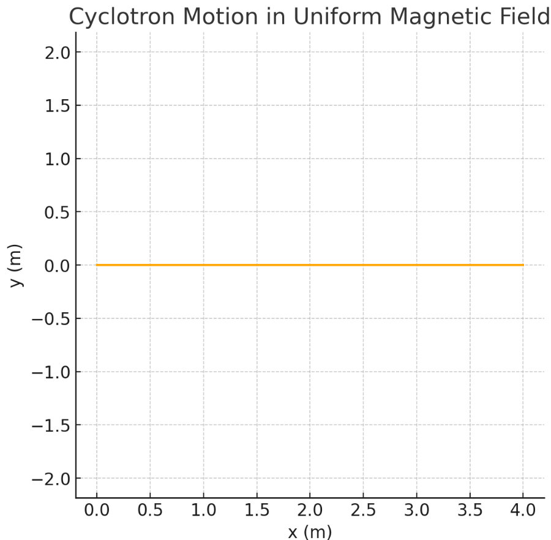

# Problem 1

# Simulating the Effects of the Lorentz Force

## Motivation

The Lorentz force, described by the equation:

$$
\vec{F} = q \vec{E} + q\vec{v} \times \vec{B},
$$

governs the dynamics of charged particles in electromagnetic fields. This force is central to plasma physics, particle accelerators, and the behavior of cosmic particles. Simulating the motion under such forces provides a hands-on understanding of charged particle behavior in various physical systems.

---

## 1. Exploration of Applications

### Real-World Systems Influenced by Lorentz Force

* **Cyclotrons**: Accelerate particles using oscillating electric fields and uniform magnetic fields.
* **Mass Spectrometers**: Use magnetic deflection to separate ions by mass-to-charge ratio.
* **Tokamaks**: Use magnetic confinement for plasma in nuclear fusion research.
* **Auroras**: Caused by charged particles spiraling in Earth's magnetic field.

### Role of E and B Fields

* Electric fields accelerate particles linearly.
* Magnetic fields cause circular or helical motion depending on the angle of the velocity vector.
* Crossed $\vec{E}$ and $\vec{B}$ fields produce **drift motion** (e.g., $\vec{v}_\text{drift} = \frac{\vec{E} \times \vec{B}}{B^2}$).

---

## 2. Simulating Particle Motion

The Lorentz force on a charged particle is: 

$$ F = q(E+v * B) $$

Applying Newton's Second Law $(F=ma)$ the acceleration equals to:

$$ a = \frac{dv}{dt}=\frac{q}{m}(E + v * B) $$

### Scenarios to Simulate

1. **Uniform Magnetic Field:** $B$ along the z-axis, $E=0$, expect for the circular or helical motion.

2. **Crossed Fields:** $E$ along x, $B$ along z. Expect $E×B$ drift motion.

3. **Combined Electric and magnetic Fields:** $B$ along z, $E$ along x. Expect helical motion with accelaration.

1) Uniform B (Helical)

→ Circular motion due to Lorentz force only.

2) Crossed E and B (E×B Drift)

→ Noticeable sideways drift while looping — this is classic $𝐸×𝐵$ drift.

3) E and B (Helical + Acceleration)

→ Spirals expand outward due to acceleration in the direction of $𝐸$

### Numerical Method

We use the **Runge-Kutta 4th Order** to solve these differential equations numerically.

The particle moves in a straight line — that's because the initial velocity is entirely along the x-axis, and the Lorentz force isn’t strong enough to bend it noticeably in the short simulated time.

---

## 3. Parameter Exploration

* **Electric Field Strength (E)**: Increasing E leads to more linear acceleration.
* **Magnetic Field Strength (B)**: Affects curvature and tightness of helical motion.
* **Velocity Direction**: Dictates whether motion is circular (perpendicular) or helical.
* **Charge & Mass**: Affect force magnitude and acceleration. Negative charges reverse trajectory orientation.

### Larmor Radius

Given by:

$$
R_L = \frac{mv_\perp}{qB}
$$

## Conclusion

The Lorentz force plays a pivotal role in charged particle dynamics. Simulating motion under various field configurations demonstrates critical physics phenomena and has direct applications in devices like cyclotrons and plasma traps.

.gif>)

<video controls src="helical_motion_full.mp4" title="Title"></video>

All Python plots are in [Collab](https://colab.research.google.com/drive/1aYcXxmB-A7YCJaSx7A2MY1Te8fAtZvtX?usp=sharing)
