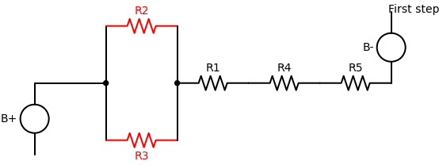
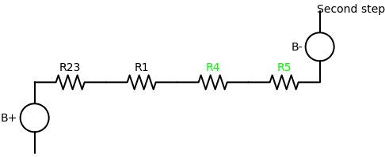
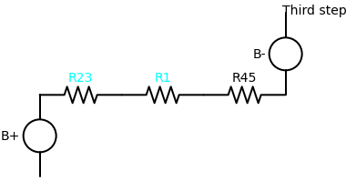
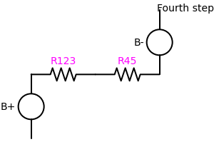
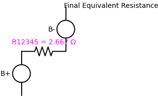

# Problem 1:

# Equivalent Resistance Using Graph Theory: Circuit Simplification: Visualizing Equivalent Resistance

##  Goal

To demonstrate how the **equivalent resistance** of a circuit evolves as we **remove one resistor at a time**, while adjusting values of remaining resistors to preserve or compare $R_{\text{eq}}$.

---

## Initial Circuit

We consider a resistor network with the following values:

- $R_1 = 0.267\,\Omega$
- $R_2 = 4\,\Omega$
- $R_3 = 6\,\Omega$
- $R_4 = 1.2\,\Omega$
- $R_5 = 1.2\,\Omega$

The schematic structure is:

```
        ┌──── R2 = 4Ω ────┐
A ── R1 ┤                 ├── R4 ── R5 ── B
        └──── R3 = 6Ω ────┘
```

---

##  Step-by-Step Simplification

### Step 1: Parallel Combination $R_{23}$

We start by simplifying $R_2$ and $R_3$ in parallel:

$$
\frac{1}{R_{23}} = \frac{1}{R_2} + \frac{1}{R_3} = \frac{1}{4} + \frac{1}{6} = \frac{5}{12}
$$

$$
R_{23} = \frac{12}{5} = 2.4 \, \Omega
$$

### Step 2: Combine $R_4$ and $R_5$

These are in series:

$$
R_{45} = R_4 + R_5 = 1.2 + 1.2 = 2.4 \, \Omega
$$

### Step 3: Combine $R_{23}$ and $R_{45}$ in Parallel

Now we combine those two parallel branches:

$$
\frac{1}{R_{2345}} = \frac{1}{R_{23}} + \frac{1}{R_{45}} = \frac{1}{2.4} + \frac{1}{2.4} = \frac{2}{2.4}
$$

$$
R_{2345} = \frac{2.4}{2} = 1.2 \, \Omega
$$

### Step 4: Add $R_1$ in Series

Finally:

$$
R_{\text{eq}} = R_1 + R_{2345} = 0.267 + 2.4 = 2.667 \, \Omega
$$

**Final equivalent resistance:**  
**$R_{\text{eq}} = 2.667 \Omega$**

---

## Insight

This process shows how different resistor configurations — even when visually complex — can be **systematically reduced** using basic parallel and series rules. This is a core principle in **graph-based circuit analysis**, which allows us to simplify, analyze, and redesign circuits efficiently.

---

## Visual Circuit Steps

  

   

 

 

 
 
 Python implementations are in [Collab](https://colab.research.google.com/drive/12GTBwiNby3IxKENQUjtxPdjeVxnk3_vg?usp=sharing)
