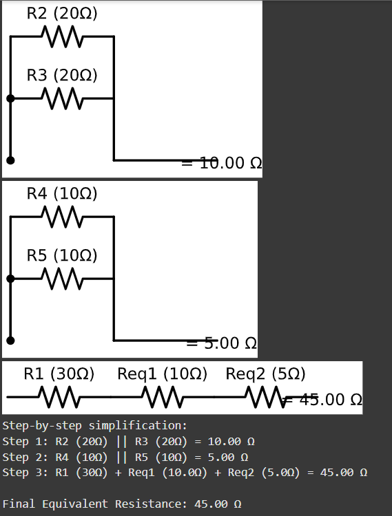

# Problem 1:

# Equivalent Resistance Using Graph Theory: Circuit Simplification: Visualizing Equivalent Resistance

##  Goal

To demonstrate how the **equivalent resistance** of a circuit evolves as we **remove one resistor at a time**, while adjusting values of remaining resistors to preserve or compare $R_{\text{eq}}$.

---

.png>) 
.png>) 
.png>) 
.png>) 

### Details of the computations and highlights

 Python implementations are in [Collab](https://colab.research.google.com/drive/12GTBwiNby3IxKENQUjtxPdjeVxnk3_vg?usp=sharing)
