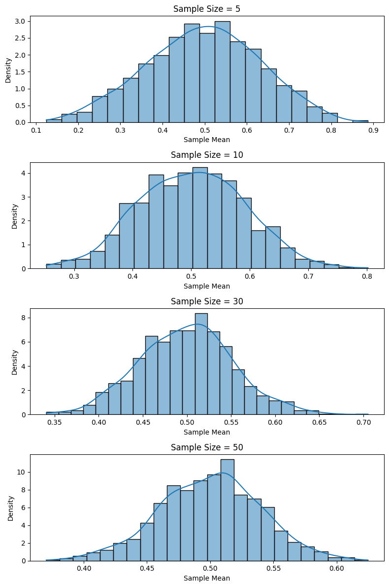
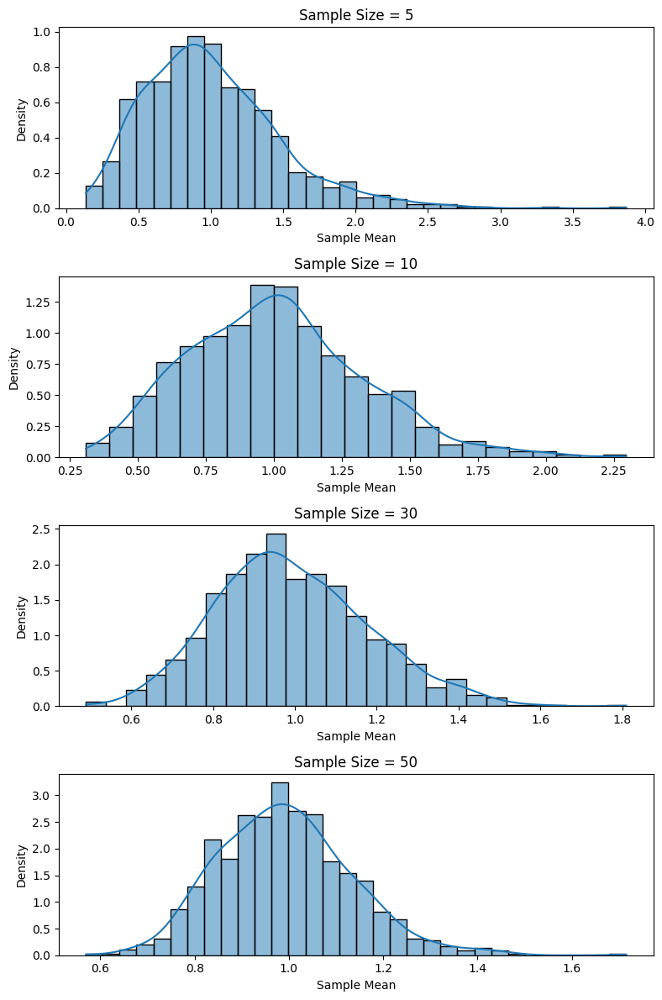
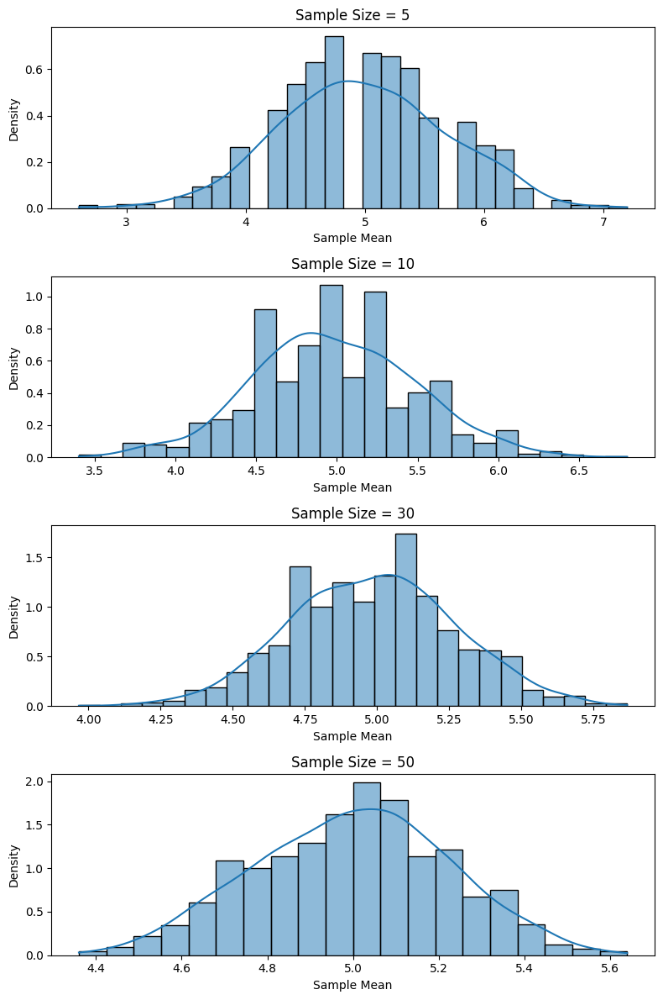

# Problem 1

# Exploring the Central Limit Theorem through Simulations

## Motivation

The Central Limit Theorem (CLT) states that the sampling distribution of the sample mean approaches a normal distribution as the sample size increases, regardless of the original population distribution. Through computational simulations, we can visualize this convergence, reinforcing theoretical expectations and illustrating the robustness of the CLT in various contexts.

---

## 1. Simulating Sampling Distributions

### Selected Population Distributions:

* **Uniform distribution** (e.g., \[0, 1])
* **Exponential distribution** (mean = 1)
* **Binomial distribution** (n=10, p=0.5)

```python
import numpy as np
import matplotlib.pyplot as plt
import seaborn as sns

# Population setup
n_samples = 1000
sample_sizes = [5, 10, 30, 50]
distributions = {
    'Uniform': np.random.uniform(0, 1, 100000),
    'Exponential': np.random.exponential(1, 100000),
    'Binomial': np.random.binomial(10, 0.5, 100000)
}
```

---

## 2. Sampling and Visualization

### Function to Simulate Sampling Distributions:

**Uniform Distribution**



**Exponential Distribution**

  
 
**Binomial Distribution**

 

---

## 3. Parameter Exploration

### Observations:

* As the **sample size increases**, the shape of the histogram of sample means becomes more bell-shaped.
* The **spread of the sampling distribution** decreases with larger sample sizes, aligning with the formula:

$$
\text{Standard Error} = \frac{\sigma}{\sqrt{n}}
$$

* Populations with higher variance (e.g., Exponential) require **larger sample sizes** for the CLT to take effect visibly.

---

## 4. Practical Applications

The Central Limit Theorem is critical for:

* **Estimating population parameters** when the full population is inaccessible.
* **Quality control**: Detecting shifts in manufacturing process means.
* **Financial modeling**: Approximating returns or aggregated risks.

---

## Conclusion

These simulations visually validate the Central Limit Theorem. Regardless of the population's initial distribution, the sampling mean distribution converges toward normality as sample size grows. This insight empowers statistical inference and underpins numerous real-world applications in science and industry.

Python codes are [here](https://colab.research.google.com/drive/1B8TNG8LqCyDMFQNb1HaxijSjM2NNS036?usp=sharing)
