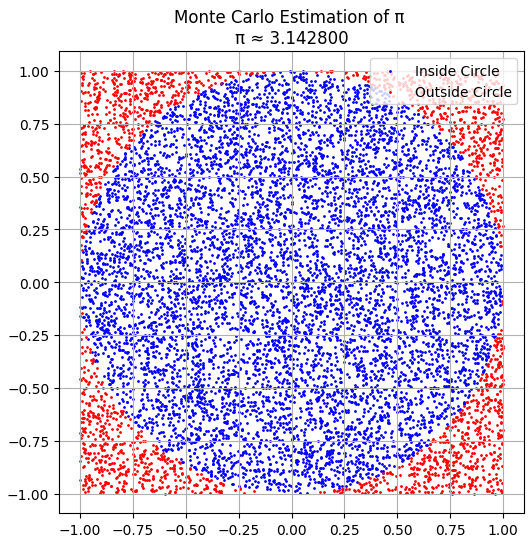
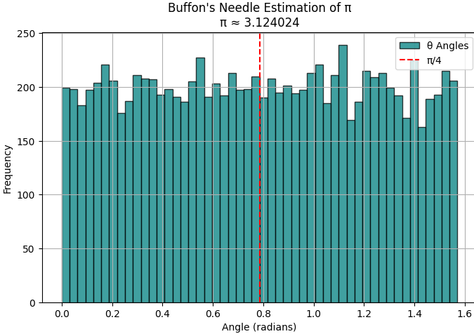

# Problem 2

# Estimating $\Pi$ using Monte Carlo Methods

## Motivation

Monte Carlo methods utilize randomness to approximate values that may be analytically intractable. Estimating $\pi$ using random sampling is a well-known illustration, linking geometry, probability, and computation. This technique is widely applicable in physics, finance, and other scientific fields.

---

## Part 1: Estimating $\pi$ Using a Circle

### 1. Theoretical Foundation

A unit circle (radius = 1) inscribed in a square of side 2 has an area of:

* Circle: $A_c = \pi r^2 = \pi \times 1^2 = \pi$
* Square: $A_s = 4$

The probability that a randomly generated point in the square falls inside the circle is:

$$
P = \frac{A_c}{A_s} = \frac{\pi}{4} \Rightarrow \pi \approx 4 \cdot \frac{\text{points inside circle}}{\text{total points}}
$$

### 2. Simulation 

Blue dots → Random points that fall inside the unit circle

Red dots → Random points that fall outside the circle

The boundary of the circle is clean and visible — exactly what you'd expect for $𝑥^2 + 𝑦^2 ≤1$

Approximate estimate of $\pi ≈ 3.1428$ 

### 3. Analysis

* **Convergence Rate**: Slow, proportional to $\frac{1}{\sqrt{n}}$
* **Accuracy**: Improves with increasing number of points

---

## Part 2: Estimating $\pi$ Using Buffon’s Needle

### 1. Theoretical Foundation

Buffon’s Needle problem estimates $\pi$ by dropping a needle of length $l$ on a plane with parallel lines spaced $d$ apart:

If $l \leq d$, the probability of the needle crossing a line is:

$$
P = \frac{2l}{\pi d} \Rightarrow \pi \approx \frac{2lN}{dC}
$$

Where:

* $N$: total drops

* $C$: crossings

### 2. Simulation 

### 3. Analysis

* Requires many trials to converge due to rare events (line crossings).
* Slower convergence than circle-based method.

---

## Comparison & Conclusion

| Method          | Convergence Rate | Visualization Complexity | Robustness        |
| --------------- | ---------------- | ------------------------ | ----------------- |
| Circle-Based    | $1/\sqrt{n}$     | Easy                     | High              |
| Buffon’s Needle | $\propto 1/n$    | Medium                   | Low (for small n) |

Monte Carlo methods provide powerful visual and practical tools for estimating $\pi$. The circle method is more efficient and reliable for small to medium simulations, while Buffon’s method offers deep geometric insights and historical interest.

Python codes are [here](https://colab.research.google.com/drive/1B8TNG8LqCyDMFQNb1HaxijSjM2NNS036?usp=sharing)