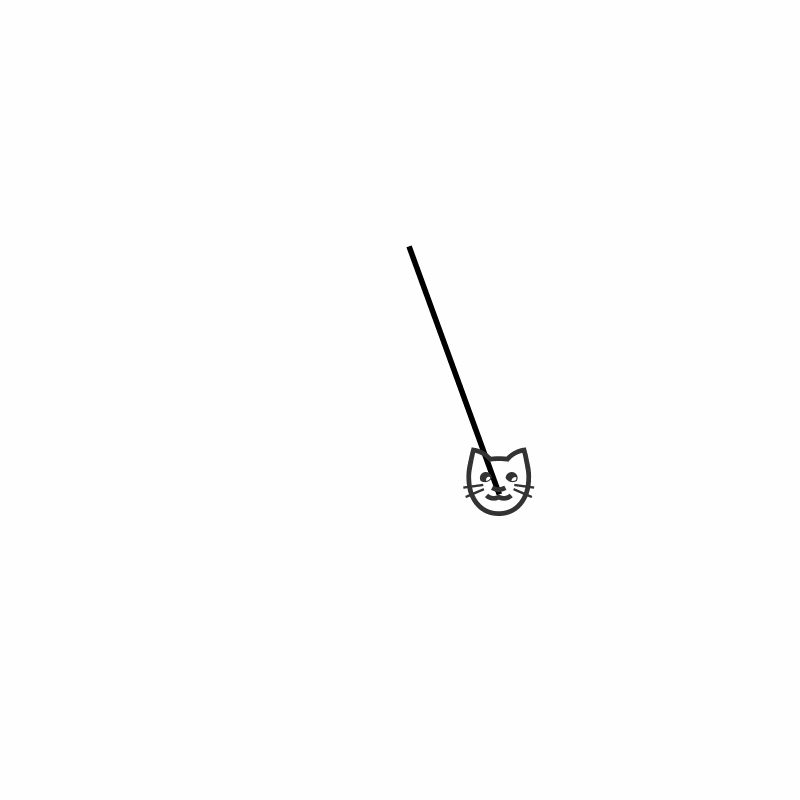

# Problem 1

# Measuring Earth's Gravitational Acceleration with a Pendulum

## Motivation

The gravitational acceleration $g$ is a key physical constant. Measuring it using a simple pendulum provides a practical approach to understanding experimental physics, wave motion, and the effect of uncertainties in measurements.

---

## Materials

* String: $L= 15cm = 0.15m$

* Mass: Key chain

* Stopwatch: Smartphone



---

## Data Collection

* Estimated Length: $L = 0.15$ m 

* Uncertainty: $\Delta L = 0.0005$ m

 10 full oscillations 10 times (measurements in seconds):

```
7.83, 7.86, 7.84, 7.88, 7.85, 7.87, 7.85, 7.83, 7.84, 7.86
```
---

## Calculations

### Step 1: Mean $\overline{T}$

$$
\overline{T_{10}} = \frac{1}{10} \sum_{i=1}^{10} T_{10,i} = 7.851 \ \text{s}
$$

### Step 2: Standard Deviation $\sigma_T$

$$
\sigma_T = \sqrt{ \frac{1}{n - 1} \sum_{i=1}^n (T_{10,i} - \overline{T_{10}})^2 } = 0.0174 \ \text{s}
$$

### Step 3: Uncertainty in the Mean $\Delta T$

$$
\Delta T_{10} = \frac{\sigma_T}{\sqrt{n}} = \frac{0.0174}{\sqrt{10}} = 0.0055 \ \text{s}
$$

### Step 4: Period of one swing:

$$
T = \frac{\overline{T_{10}}}{10} = \frac{7.851}{10} = 0.7851 \ \text{s}
$$

### Step 5: Uncertainty in period:

$$
\Delta T = \frac{\Delta T_{10}}{10} = \frac{0.0055}{10} = 0.00055 \ \text{s}
$$

### Step 6: Calculated $g$

$$
g = \frac{4\pi^2 L}{T^2} = \frac{4 \cdot \pi^2 \cdot 0.15}{(0.7851)^2}
$$

$$
g = \frac{5.92176}{0.6164} = 9.616 \ \text{m/s}^2
$$


### Step 7: Uncertainty in $g$

Using propagation of uncertainty:

$$
\Delta g = g \cdot \sqrt{ \left( \frac{\Delta L}{L} \right)^2 + \left( 2 \cdot \frac{\Delta T}{T} \right)^2 }
$$

$$
\Delta g = 9.616 \cdot \sqrt{ \left( \frac{0.0005}{0.15} \right)^2 + \left( 2 \cdot \frac{0.00055}{0.7851} \right)^2 }
= 9.616 \cdot 0.00361 = 0.035 \ \text{m/s}^2
$$


---

## Final Results

| Quantity                    | Value     |
| --------------------------- | --------- |
| Length (L)                  | 0.15 m    |
| Uncertainty ($\Delta L$)    | 0.0005 m  |
| Mean $T$                    | 7.851s    |
| Std Dev ($\sigma_T$)        | 0.0174 s  |
| Uncertainty ($\Delta T$)    | 0.00055 s |
| Calculated $g$              | 9.616 m/s²|
| Uncertainty ($\Delta g$)    | 0.035 m/s²|

---

## Discussion

- **Comparison to standard gravity**:  

  The standard value of $g$ is $9.81 \ \text{m/s}^2$. Our measured value is $9.616 \ \text{m/s}^2$, which is slightly lower. This could result from timing delay, air resistance, or local gravity variations.

- **Effect of $\Delta L$**:  

  The uncertainty in length came from the ruler's resolution (1 mm), giving $\Delta L = 0.0005$ m. Although small, it still contributes to the total uncertainty.

- **Effect of timing on $\Delta T$**:  

  Using a manual stopwatch introduces human reaction time. The standard deviation across trials shows some variability, highlighting the importance of precise timing.

- **Assumptions**:

  - Small angle approximation was valid (displacement <15°).

  - Air resistance and friction were ignored.

